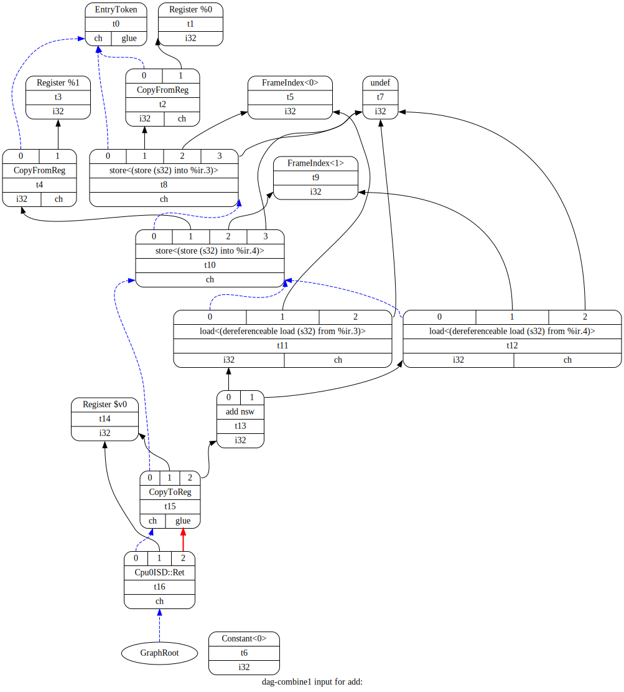

# llvm backend lowering学习笔记

[toc]

## 1.lowering过程简介

### 1.1 什么是`lowering`过程
将输入的<b>IR</b>转换成<b>SelectionDAG</b>的过程被称作lowering, 在lowering之前我们通过<b>IR</b>表示一段程序, 在lowering之后我们使用<b>SelectionDAG</b>来描述同一段程序

### 1.2 为什么需要`lowering`
<b>IR</b>中每个节点只能有一个输出(表示一个操作符/操作数的对象Node本身只有一个输出值), 而<b>SelectionDAG</b>中的节点通常有多个输出, 并且输出不一定是一个参与运算的值. <b>SelectionDAG</b>会包含非数据的依赖关系, 我们可以通过UseList获取显示引用这个操作符/操作数的使用者, 但无法获取非数据依赖的引用关系, 也就是<b>SelectionDAG</b>体现了节点之间的约束关系, 而<b>IR</b>只能表示节点的数据流图.

### 1.3 分析一个简单的例子
1. 首先一个test.c的C程序
``` {.line-numbers}
int add(int a, int b) {
  int c = a + b;
  return c;
}
```

执行:
<b>_`clang -c ./test.c -emit-llvm -S -o test.ll`_</b>

生成[test.ll](./resource/simple_test/test.ll)如下:
``` {.line-numbers}
; ModuleID = './test.c'
source_filename = "./test.c"
target datalayout = "e-m:e-p270:32:32-p271:32:32-p272:64:64-i64:64-f80:128-n8:16:32:64-S128"
target triple = "x86_64-pc-linux-gnu"

; Function Attrs: noinline nounwind optnone uwtable
define dso_local i32 @add(i32 noundef %0, i32 noundef %1) #0 {
  %3 = alloca i32, align 4
  %4 = alloca i32, align 4
  %5 = alloca i32, align 4
  store i32 %0, i32* %3, align 4
  store i32 %1, i32* %4, align 4
  %6 = load i32, i32* %3, align 4
  %7 = load i32, i32* %4, align 4
  %8 = add nsw i32 %6, %7
  store i32 %8, i32* %5, align 4
  %9 = load i32, i32* %5, align 4
  ret i32 %9
}

attributes #0 = { noinline nounwind optnone uwtable "frame-pointer"="all" "min-legal-vector-width"="0" "no-trapping-math"="true" "stack-protector-buffer-size"="8" "target-cpu"="x86-64" "target-features"="+cx8,+fxsr,+mmx,+sse,+sse2,+x87" "tune-cpu"="generic" }

!llvm.module.flags = !{!0, !1, !2, !3, !4}
!llvm.ident = !{!5}

!0 = !{i32 1, !"wchar_size", i32 4}
!1 = !{i32 7, !"PIC Level", i32 2}
!2 = !{i32 7, !"PIE Level", i32 2}
!3 = !{i32 7, !"uwtable", i32 1}
!4 = !{i32 7, !"frame-pointer", i32 2}
!5 = !{!"Ubuntu clang version 14.0.0-1ubuntu1.1"}
```

执行:
<b>_`llc -march=cpu0 -filetype=asm test.ll -debug-only=isel -o test.s 2>test.isel`_</b>
得到指令选择阶段的输出<b>[test.isel](./resource/simple_test/test.isel)</b>, 截取一小部分如下:
```
=== add
Enabling fast-isel
Found argument copy elision candidate:   %3 = alloca i32, align 4
Found argument copy elision candidate:   %4 = alloca i32, align 4
Initial selection DAG: %bb.0 'add:'
SelectionDAG has 21 nodes:
  t0: ch,glue = EntryToken
  t6: i32 = Constant<0>
      t2: i32,ch = CopyFromReg t0, Register:i32 %0
    t8: ch = store<(store (s32) into %ir.3)> t0, t2, FrameIndex:i32<0>, undef:i32
    t4: i32,ch = CopyFromReg t0, Register:i32 %1
  t10: ch = store<(store (s32) into %ir.4)> t8, t4, FrameIndex:i32<1>, undef:i32
  t11: i32,ch = load<(dereferenceable load (s32) from %ir.3)> t10, FrameIndex:i32<0>, undef:i32
  t12: i32,ch = load<(dereferenceable load (s32) from %ir.4)> t10, FrameIndex:i32<1>, undef:i32
    t15: ch = TokenFactor t11:1, t12:1
    t13: i32 = add nsw t11, t12
  t16: ch = store<(store (s32) into %ir.5)> t15, t13, FrameIndex:i32<2>, undef:i32
    t17: i32,ch = load<(dereferenceable load (s32) from %ir.5)> t16, FrameIndex:i32<2>, undef:i32
  t19: ch,glue = CopyToReg t16, Register:i32 $v0, t17
  t20: ch = Cpu0ISD::Ret t19, Register:i32 $v0, t19:1
```

执行:
<b>
```
llc -march=[arch] -filetype=asm -view-dag-combine1-dags ./test.ll -o ./test.s
```
</b>
可以生成combine之前的dot图, 如下图所示:


## 2 SelectionDAG简介

SelectionDAG提供了一种代码的抽象表示, 它可以使用自动化技术进行<b><font color=RED>指令选择</font></b>, 它也非常适合CodeGenerator的其他阶段, 特别是指令调度(SelectionDAG与选择后的调度DGA非常相似); 此外, SelectionDAG还提供了一种主机表示, 可以在其中执行各种非常低级(但独立于目标)的优化; 这些优化需要目标架构的支持信息;

SelectionDAG是一个有向无环图, 其节点是该类实例SDNode; SDNode的有效信息是SDNode内部的Opcode, 节点操作码和节点调操作数; <b><font color=RED>include/llvm/CodeGen/ISDOpcode.h</font></b>描述了各种操作节点类型;

SelectionDAG包含两种不同类型的值: 表示数据流的值和表示控制流依赖关系的值;

### 2.1 SelectionDAG指令选择的过程

基于SelectionDAG的指令选择包括以下步骤：
  * 构建初始DAG: 此阶段执行从输入LLVM代码到非法SelectionDAG的简单转换

  * 优化SelectionDAG: 此阶段对SelectionDAG进行简单的优化以简化它, 并识别支持这些元操作的目标的元指`令

  * 合法化SelectionDAG类型: 此阶段转换SelectionDAG节点以消除目标架构不支持的任何类型

  * 优化SelectionDAG: 运行SelectionDAG优化器来清理类型合法化暴露的冗余

  * 合法化SelectionDAG ops: 此阶段转换SelectionDAG节点以消除目标架构不支持的任何操作

  * 优化SelectionDAG: 运行SelectionDAG优化器以消除合法化引入的低效率

  * 从DAG中选择指令: 目标架构指令选择器将DAG操作与目标指令进行匹配, 此过程将与目标架构无关的DAG作为输入转换为目标架构指令

  * SelectionDAG调度和形成: 最后一个阶段为目标指令DAG中的指令分配线性顺序, 并将它们发送到正在编译的MachineFunction中;